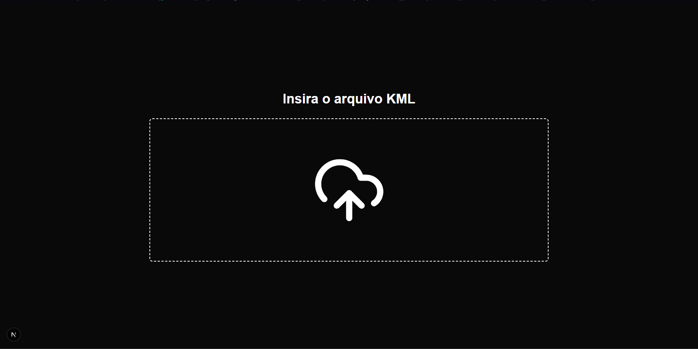
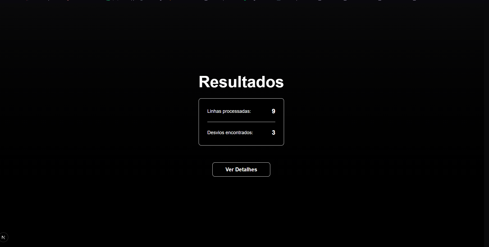
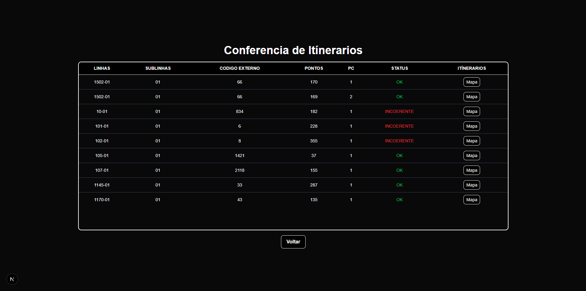
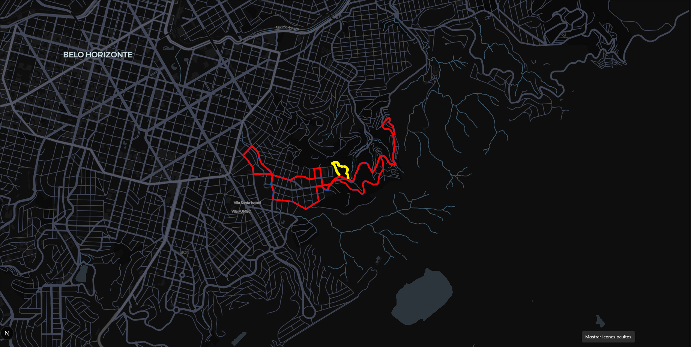

# WebServiceItinerarios


Sistema web desenvolvido para conferência de itinerários de linhas de transporte público a partir de arquivos **KML**, comparando o trajeto informado com dados retornados por uma API externa e exibindo visualmente os pontos de divergência em um mapa interativo.

## Visão geral

O **WebServiceItinerarios** automatiza a validação de rotas operacionais. O usuário envia um arquivo `.kml`, o sistema processa as linhas contidas no documento, busca os respectivos itinerários em uma base externa, compara os trajetos e apresenta um resumo com as linhas processadas, a quantidade de desvios encontrados e uma tela detalhada com o status de cada itinerário.

A aplicação também permite abrir um mapa para visualizar a diferença entre o trajeto original e o trajeto consultado, destacando os pontos considerados divergentes.

## Demonstração

### Upload do arquivo KML



### Resultado do processamento



### Tabela de conferência



### Visualização no mapa




## Funcionalidades

* Upload de arquivo `.kml`.
* Leitura e conversão de XML/KML para JSON.
* Extração de linhas, sublinhas, pontos e coordenadas.
* Consulta de identificadores de linhas em API externa.
* Consulta de itinerários oficiais em formato KML.
* Conversão de resposta Base64 para KML legível.
* Comparação geográfica entre dois trajetos.
* Detecção de pontos com desvio acima do limite definido.
* Resumo com total de linhas processadas e desvios encontrados.
* Tabela de conferência com status `OK` ou `INCOERENTE`.
* Visualização dos trajetos em mapa interativo.
* Destaque visual dos pontos divergentes no mapa.
* Interface escura, simples e objetiva.

## Como funciona

O fluxo principal da aplicação segue estas etapas:

1. O usuário insere um arquivo `.kml`.
2. O sistema faz o parse do arquivo usando `fast-xml-parser`.
3. As linhas e sublinhas são formatadas internamente.
4. O sistema consulta uma API externa para obter o ID de cada linha.
5. Com o ID da linha, a aplicação busca o itinerário correspondente.
6. O KML retornado é convertido e suas coordenadas são extraídas.
7. As coordenadas do arquivo enviado são comparadas com as coordenadas obtidas pela API.
8. Pontos com distância superior ao limite configurado são marcados como desvios.
9. A interface exibe o resultado geral, a tabela detalhada e o mapa comparativo.

## Critério de comparação

A comparação dos itinerários é feita usando operações geoespaciais com `@turf/turf`.

O sistema percorre os pontos do trajeto enviado e calcula a distância entre cada ponto e o ponto mais próximo na linha de referência. Quando a distância ultrapassa o limite configurado, o ponto é considerado um desvio.

Atualmente, o limite usado no código é:

```ts
if (dist > 30) {
  dev.push(a)
}
```

Ou seja, pontos com mais de **30 metros** de diferença são classificados como divergentes.

## Visualização no mapa

A tela de mapa utiliza `react-map-gl` com `maplibre-gl` para exibir:

* Rota enviada no arquivo KML.
* Rota retornada pela API externa.
* Pontos de desvio destacados.

As rotas são convertidas para objetos GeoJSON e renderizadas como camadas no mapa.

## Tecnologias utilizadas

* **Next.js**
* **React**
* **TypeScript**
* **Tailwind CSS**
* **Base UI**
* **shadcn/ui**
* **Lucide React**
* **fast-xml-parser**
* **@turf/turf**
* **MapLibre GL**
* **React Map GL**

## Estrutura do projeto

```txt
WebServiceItinerarios/
├── public/
├── src/
│   ├── actions/
│   │   ├── compareRoutes.ts     # Compara coordenadas e identifica desvios
│   │   └── lines.ts             # Consulta dados das linhas e itinerários
│   ├── app/
│   │   ├── itinerarios/
│   │   │   └── page.tsx         # Tela principal de upload, resultado e tabela
│   │   ├── map/
│   │   │   └── page.tsx         # Página responsável por abrir o mapa
│   │   ├── globals.css          # Estilos globais e tema da aplicação
│   │   ├── layout.tsx           # Layout principal
│   │   └── page.tsx             # Redirecionamento para /itinerarios
│   ├── components/
│   │   ├── clients/
│   │   │   └── map.tsx          # Componente de mapa interativo
│   │   └── ui/
│   │       ├── button.tsx       # Componente de botão
│   │       └── table.tsx        # Componentes de tabela
│   └── lib/
│       ├── api/
│       ├── types/
│       └── utils.ts
├── package.json
├── next.config.ts
├── tsconfig.json
└── README.md
```

## Pré-requisitos

Antes de executar o projeto, tenha instalado:

* Node.js
* npm, yarn, pnpm ou bun
* Token de acesso para a API externa utilizada pelo sistema

## Como executar localmente

Clone o repositório:

```bash
git clone https://github.com/Mateusdev3/WebServiceItinerarios.git
```

Acesse a pasta do projeto:

```bash
cd WebServiceItinerarios
```

Instale as dependências:

```bash
npm install
```

Crie um arquivo `.env.local` na raiz do projeto:

```env
NEXT_PUBLIC_TOKEN_TACOM=seu_token_aqui
```

Execute o ambiente de desenvolvimento:

```bash
npm run dev
```

Acesse no navegador:

```txt
http://localhost:3000
```

## Scripts disponíveis

```bash
npm run dev      # Inicia o projeto em ambiente de desenvolvimento
npm run build    # Gera a build de produção
npm run start    # Executa a build de produção
npm run lint     # Executa a verificação de lint
```

## Variáveis de ambiente

| Variável                  | Descrição                                                                        |
| ------------------------- | -------------------------------------------------------------------------------- |
| `NEXT_PUBLIC_TOKEN_TACOM` | Token utilizado para autenticação nas requisições da API externa de itinerários. |


## Observação sobre segurança

O projeto utiliza token para autenticação em API externa. Para maior segurança em produção, o ideal é manter esse token apenas no lado do servidor e evitar expor credenciais públicas no front-end.

Caso o token não precise estar disponível no navegador, considere renomear a variável para algo sem o prefixo `NEXT_PUBLIC_`, como:

```env
TOKEN_TACOM=seu_token_aqui
```

E ajustar o código para utilizar essa variável apenas em Server Actions ou rotas internas.

## Exemplo de uso

1. Abra a aplicação.
2. Envie um arquivo `.kml` válido.
3. Aguarde o processamento.
4. Veja o total de linhas processadas e desvios encontrados.
5. Clique em **Ver Detalhes** para acessar a tabela completa.
6. Clique em **Mapa** para visualizar a comparação geográfica do itinerário.

## Objetivo técnico

Este projeto demonstra conhecimentos em:

* Desenvolvimento full stack com Next.js e TypeScript.
* Manipulação de arquivos no navegador.
* Processamento de XML/KML.
* Integração com APIs externas autenticadas.
* Conversão e normalização de dados geográficos.
* Uso de GeoJSON.
* Cálculos geoespaciais com Turf.js.
* Renderização de mapas com MapLibre.
* Construção de interfaces com React e Tailwind CSS.
* Organização de projeto com App Router do Next.js.

## Melhorias futuras

* Adicionar tratamento visual para erros de arquivo inválido.
* Permitir configurar o limite de desvio diretamente pela interface.
* Gerar relatório em PDF ou Excel com as inconsistências encontradas.
* Adicionar filtros por linha, sublinha, status e sentido.
* Melhorar a legenda do mapa.
* Permitir exportação dos pontos divergentes em KML ou GeoJSON.
* Criar tela de histórico de conferências.
* Adicionar autenticação de usuário.
* Implementar testes automatizados para o parser e para a comparação de rotas.
* Melhorar a responsividade da tabela em telas menores.

## Autor

Desenvolvido por **Mateus Esteves**.

## Licença

Este projeto está sob a licença MIT. Sinta-se à vontade para usar, estudar e adaptar.
